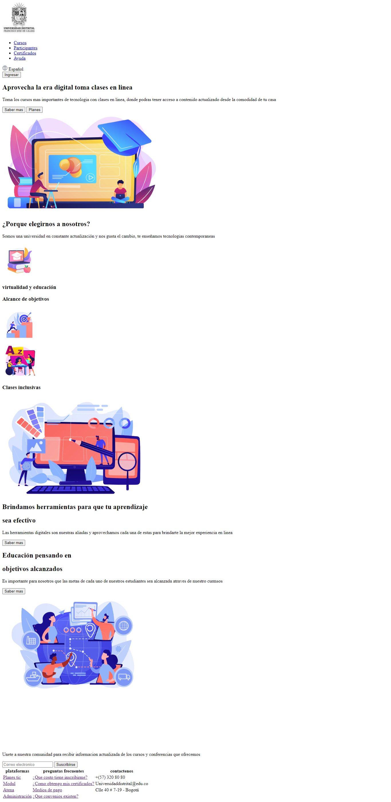

<h1>Taller 9 Adolfo Ramirez Perdomo

<h2> Información</h2>

Curso: full Stack Basico - Grupo 1

Profesor: Cristian Patiño

<h2> Punto 1: Link figma</h2>

<a href="https://www.figma.com/file/VO1wGPTJrt7Ha8jqjIwK9S/Adolfo-Ramirez-Perdomo_Figma?type=design&node-id=0%3A1&mode=design&t=C2qprj7DxG58hwBZ-1" target="_blank">Link de Figma</a>

<h2> Punto 2: Html </h2>

<h2> Punto 3: Html </h2>

<h2> Punto 4: Html </h2>

